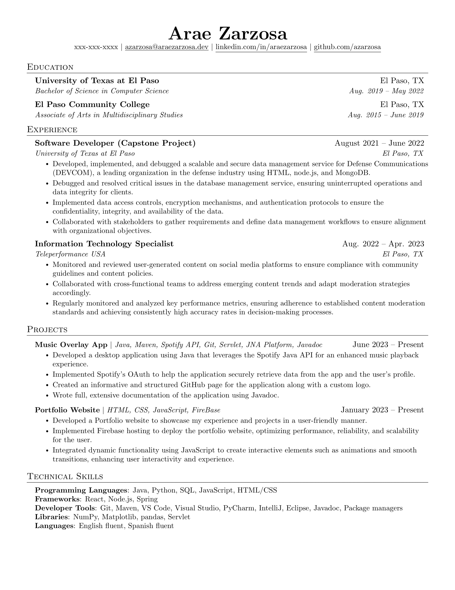

# resume
LaTeX template for my personal resume

Forked off of [jakegut/resume](https://github.com/jakegut/resume/)



## Build

On macOS, install the TeX Live command-line tools before building:

```sh
brew install --cask mactex-no-gui
eval "$(/usr/libexec/path_helper)"
```

Then run:

```sh
make pdf
```

`latexmk` is provided by MacTeX. The LaTeX checker is named `chktex` (with a
`k`); `chtex` is not a valid executable name. Run `make lint` to use it.

If VS Code still reports `spawn latexmk ENOENT` after installing MacTeX,
restart VS Code so it inherits the updated `PATH`.
